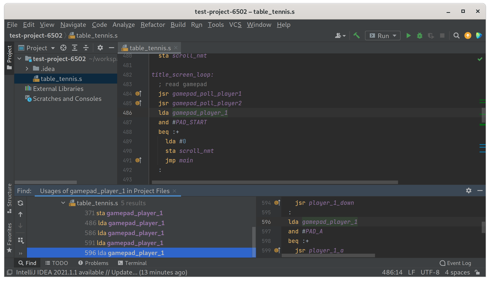

# 6502 Assembly Plugin for IntelliJ

This is plugin for JetBrains IDE's, which provides basic support for 6502 assembly language. It is suitable for projects which use the `ca65` assembler to target the WDC 6502, 65C816, and related microprocessors.

## Features

- Syntax highlighting
- Go to the definition of a label, constant or import
- Find usages
- Refactor/rename a label and its usages
- Comment/uncomment blocks of code
- Code folding for scopes, procedures and macro definitions
- Completion suggestions for mnemonics and labels
- Warnings for undefined and unused symbols
- Code formatting

## Installation

This plugin may be installed via the [JetBrains Marketplace](https://plugins.jetbrains.com/plugin/16799-6502-assembly).

## Fork Information

This is a fork of the original [6502 Assembly Plugin for IntelliJ](https://github.com/mike42/6502-assembly-intellij) by Michael Billington. The original project appears to be inactive, and this fork aims to continue its development by fixing bugs, updating dependencies, and adding new features.

## License

This plugin is based on the original work of Michael Billington (copyright 2021-2022). Modifications and further development are copyright 2025 Adam "Kubik" Kubiczek. The entire project is distributed under the terms of the MIT license. See [LICENSE](https://github.com/mike42/6502-assembly-intellij/blob/master/LICENSE) for details.

The parser/lexer were built with reference to the [ca65 assembler](https://github.com/cc65/cc65) source code (zlib License), while the icons are derived from those bundled with [JetBrains/intellij-community](https://github.com/JetBrains/intellij-community) (Apache License).

## Similar projects

I'm aware of these other plugins, which are for different assemblers.

- [4ch1m/kick-assembler-acbg](https://github.com/4ch1m/kick-assembler-acbg) - Kick Assembler
- [67726e/IntelliJ-6502](https://github.com/67726e/IntelliJ-6502) - NESASM
- [matozoid/Intellij6502](https://github.com/matozoid/Intellij6502) - 64tass

